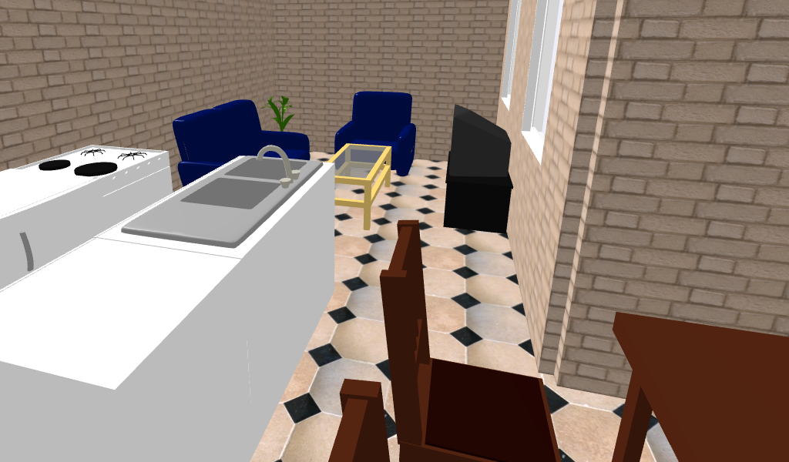

# Getting into the virtual world with WebVR/A-Frame

A VR workshop hosted at [HKOSCon 2017](https://hkoscon.org/2017/topics/getting-into-the-virtual-world-with-web-vr/) ([video recording](https://www.facebook.com/hkoscon/videos/1936144143320460/)).

Let’s get started in Virtual Reality with A-Frame, which is an open source project that allows us to develop WebVR applications like how we develop web sites - using XML based declarative markup.

We will introduce the current status of VR software and hardware, and what WebVR fits in. Using the Mozilla-developed A-Frame project, we will build a simple WebVR application that can be viewed on a desktop browser, on mobile with Google Cardboard, or even on a high-end head mounted display.

## Requirement

Participants should bring their own laptop computer, with either Windows, Mac, or Linux installed. Some HTML/JS coding skill would be great, but not necessary. Some limited amount of Google Cardboard will be lended for testing. The VR application can be developed and used without Google Cardboard or any other VR hardware.

## Preparation

Please follow the instruction listed below *before* the workshop, such that you can progress smoothly.

 * Download and install [Sweet Home 3D](http://www.sweethome3d.com/download.jsp) free edition available at SourceForge.net, version 5.4 or up.

 * Get a [Cloud9](https://c9.io/) account. It is an online development platform that includes an editor as well as other development tools (e.g. git). If you're familar with setting up a simple http dev server, feel free to skip this.
   
   Note that creating a normal account requires a credit card (no charge, just for varification). We have paid for an [education plan](https://c9.io/pricing), such that via our invitation, you can create an account without providing credit card detail. To get an invitation, send a message to [Andy on Gitter](https://gitter.im/andyli) providing your email address.

## Procedure

We will introduce WebVR and A-Frame, as well as go through creating a simple VR scene during the workshop together. The key points and details are noted in [instruction](instruction.md) for your easy reference.
